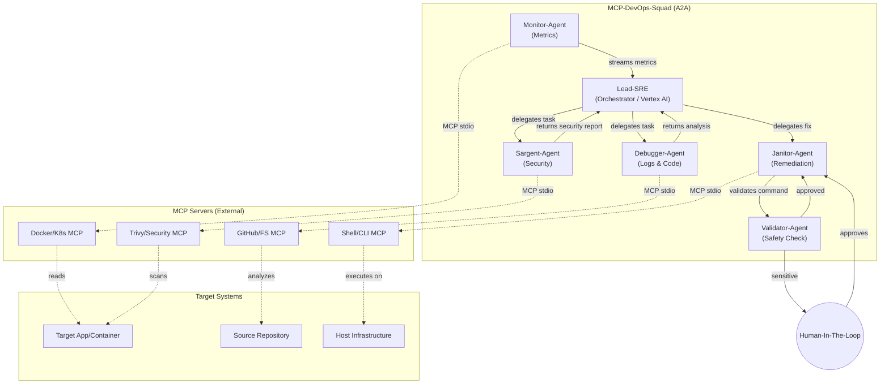

# Architecture: MCP-DevOps-Squad

## Overview
The **MCP-DevOps-Squad** is a multi-agent Site Reliability Engineering (SRE) system designed to automate monitoring, root-cause analysis, incident remediation, and security auditing using Google Agent-to-Agent (A2A) patterns and the Model Context Protocol (MCP).

## System Architecture Diagram

## Components

### 1. Lead-SRE (Orchestrator)
- **Role:** The primary decision-maker.
- **Technology:** LangChain & Google Vertex AI.
- **Function:** Analyzes metrics and logs passed from sub-agents to determine the best course of action. It delegates tasks to the Monitor, Debugger, Janitor, or Sargent based on structured Pydantic `SREDecision` objects.

### 2. Monitor-Agent
- **Role:** The eyes of the squad.
- **Technology:** Docker / Kubernetes MCP Servers.
- **Function:** Streams real-time metrics (CPU, Memory, Health) and converts them into structured `MetricUpdate` objects for the Orchestrator.

### 3. Debugger-Agent
- **Role:** The analyst.
- **Technology:** GitHub & Filesystem MCP Servers.
- **Function:** Upon receiving a task from the Lead-SRE, it investigates source code, recent commits, or log files to find the root cause of an anomaly.

### 4. Sargent-Agent
- **Role:** The security officer.
- **Technology:** Trivy / Snyk MCP Servers.
- **Function:** Investigates potential security breaches, scans container images for CVEs, and audits dependency manifests for known vulnerabilities. Returns structured `SecurityReport` objects.

### 5. Janitor-Agent & Validator-Agent
- **Role:** The executor and safety net.
- **Technology:** Shell / CLI MCP Server.
- **Function:** Responsible for taking corrective action (e.g., restarting a service, clearing disk space). 
- **Safety Loop:** Before executing any command, it passes the request through the `Validator-Agent`. If the command is deemed sensitive (e.g., `kill`, `rm`), it places it in a pending state, requiring **Human-In-The-Loop (HITL)** approval via the `config/pending_approvals.json` file.

## Data Flow (A2A Pattern)
1. **Monitor** detects an anomaly and sends a `MetricUpdate` to **Lead-SRE**.
2. **Lead-SRE** uses an LLM to analyze the data. If it requires more info, it delegates an `AgentTask` to **Debugger** or **Sargent**.
3. **Debugger/Sargent** returns its findings (e.g. log analysis or a `SecurityReport`). **Lead-SRE** makes a final decision and delegates a fix task to **Janitor**.
4. **Janitor** runs the task through **Validator**. Safe tasks execute immediately. Destructive tasks trigger the **HITL** workflow.
5. All actions and decisions are recorded via `structlog` as structured JSON events in the `/logs/` directory.
